<div align="center">

# 📚 ECIEXPRESS — Microservicio de Billetera

### *"Sin filas, sin estrés, ECIEXPRESS"*

---

### 🛠️ Stack Tecnológico


### ☁️ Infraestructura & Calidad


### 🏗️ Arquitectura


</div>

---

## 📑 Tabla de Contenidos

1. [👤 Integrantes](#1--integrantes)
2. [🎯 Objetivo del Microservicio](#2--objetivo-del-microservicio)
3. [⚡ Funcionalidades Principales](#3--funcionalidades-principales)
4. [📋 Estrategia de Versionamiento y Branches](#4--manejo-de-estrategia-de-versionamiento-y-branches)
   - [4.1 Convenciones para crear ramas](#41-convenciones-para-crear-ramas)
   - [4.2 Convenciones para crear commits](#42-convenciones-para-crear-commits)
5. [⚙️ Tecnologías Utilizadas](#5--tecnologias-utilizadas)
6. [🧩 Funcionalidad](#6--funcionalidad)
7. [📊 Diagramas](#7--diagramas)
8. [⚠️ Manejo de Errores](#8--manejo-de-errores)
9. [🧪 Evidencia de Pruebas y Ejecución](#9--evidencia-de-las-pruebas-y-como-ejecutarlas)
10. [🗂️ Organización del Código](#10--codigo-de-la-implementacion-organizado-en-las-respectivas-carpetas)
11. [🚀 Ejecución del Proyecto](#11--ejecucion-del-proyecto)
12. [☁️ CI/CD y Despliegue en Azure](#12--evidencia-de-cicd-y-despliegue-en-azure)
13. [🤝 Contribuciones](#13--contribuciones)

---

## 1. 👤 Integrantes:

- Elizabeth Correa
- Daniel Palacios
- David Salamanca
- Tomas Ramirez
- Carolina Cepeda

## 2. 🎯 Objetivo del microservicio

El microservicio de Billetera (Wallet) tiene como objetivo administrar de forma segura y confiable el saldo digital de los usuarios dentro de ECIExpress, permitiendo crear billeteras, consultar información, recargar saldo y ejecutar débitos/créditos asociados a transacciones internas. Actúa como el núcleo financiero del sistema, aplicando validaciones de negocio (por ejemplo, montos válidos y fondos suficientes) y manteniendo trazabilidad mediante timestamps, para garantizar consistencia antes de persistir los cambios. Además, se integra con otros microservicios (como Pagos y los flujos de recibos/QR) para soportar pagos rápidos y centralizados dentro del campus, eliminando el uso de efectivo y mejorando la experiencia de compra.

---

## 3. ⚡ Funcionalidades principales

<div align="center">

<table>
  <thead>
    <tr>
      <th>💡 Funcionalidad</th>
      <th>Descripción</th>
    </tr>
  </thead>
  <tbody>
    <tr>
      <td><strong>Creación de Billetera</strong></td>
      <td>Permite crear una billetera digital asociada a un, inicializando el saldo y los datos de auditoría.</td>
    </tr>
    <tr>
      <td><strong>Consulta de Billetera</strong></td>
      <td>Obtiene la información de la billetera de un usuario, incluyendo saldo actual y timestamps.</td>
    </tr>
    <tr>
      <td><strong>Recarga de Saldo</strong></td>
      <td>Incrementa el saldo de la billetera validando montos positivos y registrando la operación.</td>
    </tr>
    <tr>
      <td><strong>Pago con Billetera</strong></td>
      <td>Realiza el débito del saldo al procesar un pago, verificando fondos suficientes.</td>
    </tr>
    <tr>
      <td><strong>Validación de Fondos</strong></td>
      <td>Comprueba que el usuario tenga saldo disponible antes de autorizar una transacción.</td>
    </tr>
    <tr>
      <td><strong>Integración con Pagos</strong></td>
      <td>Se comunica con el microservicio de Pagos para autorizar o rechazar transacciones con billetera.</td>
    </tr>
    <tr>
      <td><strong>Persistencia en MongoDB</strong></td>
      <td>Almacena las billeteras en MongoDB Atlas garantizando consistencia y trazabilidad.</td>
    </tr>
    <tr>
      <td><strong>Manejo de Errores</strong></td>
      <td>Retorna respuestas claras ante billetera inexistente, saldo insuficiente o montos inválidos.</td>
    </tr>
  </tbody>
</table>

</div>                   

## 4. 📋 Manejo de Estrategia de versionamiento y branches

### Estrategia de Ramas (Git Flow)

### Ramas y propósito
- Manejaremos GitFlow, el modelo de ramificación para el control de versiones de Git

#### `main`
- **Propósito:** rama **estable** con la versión final (lista para demo/producción).
- **Reglas:**
    - Solo recibe merges desde `release/*` y `hotfix/*`.
    - Cada merge a `main` debe crear un **tag** SemVer (`vX.Y.Z`).
    - Rama **protegida**: PR obligatorio, 1–2 aprobaciones, checks de CI en verde.

#### `develop`
- **Propósito:** integración continua de trabajo; base de nuevas funcionalidades.
- **Reglas:**
    - Recibe merges desde `feature/*` y también desde `release/*` al finalizar un release.
    - Rama **protegida** similar a `main`.

#### `feature/*`
- **Propósito:** desarrollo de una funcionalidad, refactor o spike.
- **Base:** `develop`.
- **Cierre:** se fusiona a `develop` mediante **PR**


#### `release/*`
- **Propósito:** congelar cambios para estabilizar pruebas, textos y versiones previas al deploy.
- **Base:** `develop`.
- **Cierre:** merge a `main` (crear **tag** `vX.Y.Z`) **y** merge de vuelta a `develop`.
- **Ejemplo de nombre:**  
  `release/1.3.0`

#### `hotfix/*`
- **Propósito:** corregir un bug **crítico** detectado en `main`.
- **Base:** `main`.
- **Cierre:** merge a `main` (crear **tag** de **PATCH**) **y** merge a `develop` para mantener paridad.
- **Ejemplos de nombre:**  
  `hotfix/fix-blank-screen`, `hotfix/css-broken-header`


---

### 4.1 Convenciones para **crear ramas**

#### `feature/*`
**Formato:**
```
feature/[nombre-funcionalidad]-ECIExpress_[codigo-jira]
```

**Ejemplos:**
- `feature/readme_ECIExpress-34`

**Reglas de nomenclatura:**
- Usar **kebab-case** (palabras separadas por guiones)
- Máximo 50 caracteres en total
- Descripción clara y específica de la funcionalidad
- Código de Jira obligatorio para trazabilidad

#### `release/*`
**Formato:**
```
release/[version]
```
**Ejemplo:** `release/1.3.0`

#### `hotfix/*`
**Formato:**
```
hotfix/[descripcion-breve-del-fix]
```
**Ejemplos:**
- `hotfix/corregir-pantalla-blanca`
- `hotfix/arreglar-header-responsive`

---

### 4.2 Convenciones para **crear commits**

#### **Formato:**
```
[codigo-jira] [tipo]: [descripción específica de la acción]
```

#### **Tipos de commit:**
- `feat`: Nueva funcionalidad
- `fix`: Corrección de errores
- `docs`: Cambios en documentación

## 5. ⚙️ Tecnologías Utilizadas


| **Tecnología / Herramienta** | **Uso principal en el proyecto** |
|------------------------------|----------------------------------|
| **Java OpenJDK** | Lenguaje de programación base de los microservicios backend, orientado a objetos y multiplataforma. |
| **Spring Boot** | Framework principal para construir microservicios independientes, exponiendo APIs REST y gestionando configuración e inyección de dependencias. |
| **Spring Web** | Exposición de endpoints REST en cada microservicio (controladores HTTP) dentro de la arquitectura hexagonal. |
| **Spring Security** | Configuración de autenticación y autorización mediante roles, asegurando el acceso a los endpoints de los microservicios. |
| **Spring Data MongoDB** | Integración de cada microservicio con su base de datos NoSQL en MongoDB usando el patrón Repository y puertos/adaptadores. |
| **MongoDB Atlas** | Base de datos NoSQL en la nube, con colecciones independientes por dominio (pagos, billetera, recibos, promociones, usuarios, etc.). |
| **Apache Maven** | Gestión de dependencias, empaquetado de cada microservicio y automatización de builds en los pipelines CI/CD. |
| **Lombok** | Reducción de código repetitivo en los microservicios con anotaciones como `@Getter`, `@Setter`, `@Builder` y `@AllArgsConstructor`. |
| **JUnit 5** | Framework de pruebas unitarias para validar la lógica de dominio y casos de uso en cada microservicio. |
| **Mockito** | Simulación de dependencias (puertos, repositorios, clientes externos) en pruebas unitarias sin acceder a infraestructura real. |
| **JaCoCo** | Generación de reportes de cobertura de código de los microservicios para evaluar la efectividad de las pruebas. |
| **SonarQube** | Análisis estático del código y control de calidad, identificando vulnerabilidades, code smells y problemas de mantenibilidad. |
| **Swagger (OpenAPI 3)** | Generación automática de documentación y prueba interactiva de los endpoints REST de cada microservicio. |
| **Postman** | Entorno de pruebas de la API para validar manualmente las peticiones y respuestas JSON de los distintos microservicios (`POST`, `GET`, `PATCH`, `DELETE`). |
| **Docker** | Contenerización de cada microservicio para garantizar despliegues aislados y consistentes entre entornos. |
| **Azure App Service** | Entorno de ejecución en la nube donde se despliegan los contenedores Docker de los microservicios. |
| **Azure Container Registry (ACR)** | Almacenamiento y versionado de las imágenes Docker generadas en los pipelines de CI/CD. |
| **GitHub Actions** | Pipelines de integración y despliegue continuo (CI/CD) para compilar, probar, analizar y desplegar cada microservicio. |
| **AWS API Gateway** | Punto de entrada único al backend que enruta las solicitudes del cliente al microservicio correspondiente (Pagos, Wallet, Recibos, QR, etc.). |
| **AWS Lambda (Node.js)** | Funciones ligeras que actúan como lógica intermedia cuando se requiere preprocesar o adaptar solicitudes antes de enviarlas a los microservicios. |
| **SSL / HTTPS** | Cifrado de la comunicación entre cliente, API Gateway y microservicios para garantizar la seguridad de la información. |


> 🧠 **Stack tecnológico seleccionado** para asegurar **escalabilidad**, **modularidad**, **seguridad**, **trazabilidad** y **mantenibilidad**, aplicando buenas prácticas de ingeniería de software.

## 6. 🧩 Funcionalidades

El backend de **ECIExpress** implementa un **sistema de chat en tiempo real** que facilita la comunicación entre vendedores y usuarios (compradores) dentro del ecosistema universitario. El sistema permite gestionar conversaciones, enviar mensajes, administrar contactos y filtrar información de manera eficiente.

---

### 🔑 Funcionalidades principales

### 1️⃣ Crear Billetera

Permite crear una billetera digital asociada a un cliente, inicializando su saldo y los datos de auditoría.

**Endpoint principal:**  
`POST /api/v1/wallets`

---

### 📦 Estructura de la Solicitud (Request)

<div align="center">

| 🏷️ Campo    | 🗃️ Tipo | ⚠️ Restricciones                        | 📝 Descripción                                              |
|--------------|---------|:---------------------------------------:|-------------------------------------------------------------|
| ClientId     | String  | Obligatorio, No puede ser nulo ni vacío | Identificador único del cliente propietario de la billetera |
| moneyAmount  | Double  | Obligatorio, Debe ser mayor o igual a 0 | Monto inicial de la billetera                               |

</div>

---

### 📦 Estructura de la Respuesta (Response)

<div align="center">

| 🔢 Código HTTP | 📝 Descripción |
|:---:|---|
|  | **Recurso creado exitosamente.** No retorna cuerpo de respuesta. |

</div>

---

### ✅ Happy Path (Ejemplo de Uso Exitoso)

1. El cliente envía un `clientId` válido y un `moneyAmount` mayor o igual a cero.
2. El sistema valida que el cliente no tenga una billetera previa.
3. Se crea la billetera y se persiste en la base de datos.
4. Se retorna `201 CREATED` confirmando la operación.


**Request (Solicitud):**
```json
POST /api/v1/wallets
{
  "clientId": "CLIENT_12345",
  "moneyAmount": 50000.0
}

```

**Response (Respuesta):**
```json
201 CREATED
```


---

### 🖼️ Diagrama de Secuencia

  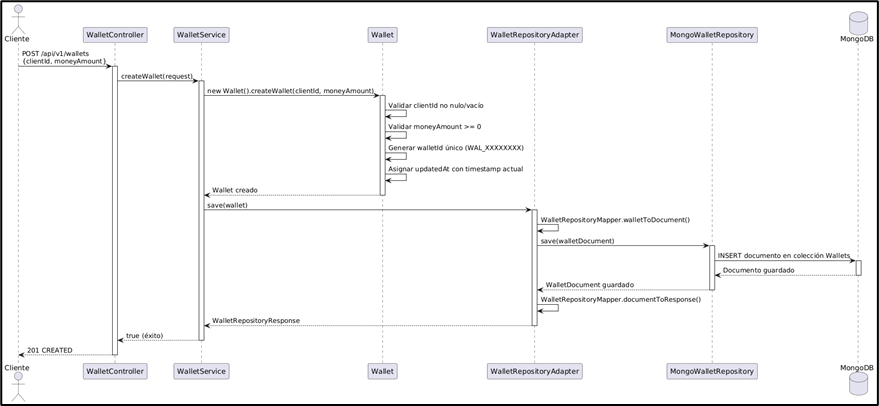


<details>
<summary><strong>🟢 Explicación del Flujo</strong></summary>

1. El flujo inicia cuando el cliente envía la solicitud al `WalletController`.
2. Este delega la operación al servicio de billetera, donde se validan los datos de entrada y la inexistencia previa de la billetera.
3. Una vez superadas las validaciones, se crea la billetera y se guarda en MongoDB.
4. El proceso finaliza enviando una respuesta exitosa al cliente.

</details>

---

### 📊 Tipos de errores manejados

<div align="center">

| 🔢 **Código HTTP** | ⚠️ **Escenario** | 💬 **Mensaje de Error** |
|:------------------:|:----------------|:------------------------|
|  | moneyAmount es menor o igual a 0 | `"El monto a agregar debe ser positivo"` |
|  | clientId es nulo o vacío | `"ClientId es requerido"` |
|  | JSON malformado | `"Solicitud JSON Inválida. El formato del JSON es incorrecto. Verifique la sintaxis."` |
|  | Cliente no tiene billetera registrada | `"Wallet No Encontrada. Wallet of CLIENT_12345 does not exist"` |
|  | Error inesperado en el servidor | `"Ocurrió un error inesperado. Por favor, contacte al administrador."` |

</div>

---

### 2️⃣ Recargar Saldo


**Endpoint principal:**  
`POST /api/v1/wallets/add-money`

---

### 📦 Estructura de la Solicitud (Request)

<div align="center">

| 🏷️ Campo    | 🗃️ Tipo | ⚠️ Restricciones                        | 📝 Descripción                                              |
|--------------|---------|:---------------------------------------:|-------------------------------------------------------------|
| ClientId     | String  | Obligatorio, No puede ser nulo ni vacío | Identificador del cliente propietario de la billetera |
| moneyAmount  | Double  | Obligatorio, Debe ser mayor o igual a 0 | Monto por recargar en la billetera                          |

</div>

---

### 📦 Estructura de la Respuesta (Response)

<div align="center">

| 🔢 Código HTTP | 📝 Descripción |
|:---:|---|
|  | **Recurso creado exitosamente.** No retorna cuerpo de respuesta. |

</div>

---

### ✅ Happy Path (Ejemplo de Uso Exitoso)

1. El cliente envía el identificador de la billetera y el monto a recargar.
2. El sistema valida que el monto sea positivo.
3. Se verifica la existencia de la billetera.
4. Se incrementa el saldo y se actualiza el registro.
5. Se retorna `201 CREATED` confirmando la recarga.


**Request (Solicitud):**
```json
POST /api/v1/wallets/add-money
{
  "clientId": "CLIENT_12345",
  "moneyAmount": 50000.0
}

```


---

### 🖼️ Diagrama de Secuencia

  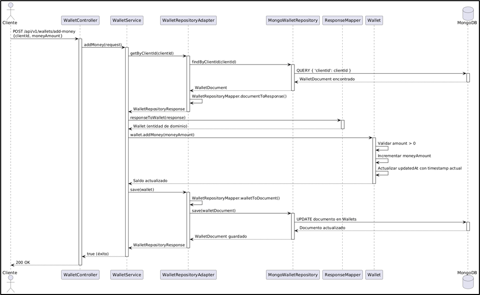


<details>
<summary><strong>🟢 Explicación del Flujo</strong></summary>

1. El controlador recibe la solicitud de recarga y delega al servicio de billetera.
2. El sistema valida el monto y verifica la existencia de la billetera.
3. Si todo es correcto, se actualiza el saldo en la base de datos y se retorna una respuesta exitosa.

</details>

---


### 📊 Tipos de errores manejados

<div align="center">

| 🔢 **Código HTTP** | ⚠️ **Escenario** | 💬 **Mensaje de Error** |
|:------------------:|:----------------|:------------------------|
|  | moneyAmount es menor o igual a 0 | `"El monto a agregar debe ser positivo"` |
|  | clientId es nulo o vacío | `"ClientId es requerido"` |
|  | JSON malformado | `"Solicitud JSON Inválida. El formato del JSON es incorrecto. Verifique la sintaxis."` |
|  | Cliente no tiene billetera registrada | `"Wallet No Encontrada. Wallet of CLIENT_12345 does not exist"` |
|  | Error inesperado en el servidor | `"Ocurrió un error inesperado. Por favor, contacte al administrador."` |

</div>


---

### 3️⃣ Realizar Pago


**Endpoint principal:**  
`POST /api/v1/wallets/pay`

---

### 📦 Estructura de la Solicitud (Request)

<div align="center">

| 🏷️ Campo    | 🗃️ Tipo | ⚠️ Restricciones                        | 📝 Descripción                                              |
|--------------|---------|:---------------------------------------:|-------------------------------------------------------------|
| ClientId     | String  | Obligatorio, No puede ser nulo ni vacío | Identificador del cliente que realiza el pago |
| moneyAmount  | Double  | Obligatorio, Debe ser mayor o igual a 0 | Monto por descontar de la billetera                            |

</div>

---

### 📦 Estructura de la Respuesta (Response)

<div align="center">

| 🏷️ Campo | 🗃️ Tipo | 📝 Descripción | 📋 Valores posibles |
|:---:|:---:|:---|:---|
| paymentStatus | PaymentStatus (enum) | Estado del pago realizado | `COMPLETED`, `FAILED`, `PENDING`, `VALIDATING`, `PROCESSING`, `REFUNDED`, `CANCELLED`, `TIMEOUT` |

</div>

---

### ✅ Happy Path (Ejemplo de Uso Exitoso)

1. El cliente solicita realizar un pago con billetera.
2. El sistema valida los datos de entrada.
3. Se verifica que la billetera exista.
4. Se comprueba que el saldo sea suficiente.
5. Se descuenta el monto del saldo.
6. Se retorna el estado `COMPLETED`.


**Request (Solicitud):**
```json
POST /api/v1/wallets/pay
{
  "clientId": "CLIENT_12345",
  "moneyAmount": 50000.0
}

```

**Response (Respuesta):**
```json
POST /api/v1/wallets/pay
{
  "paymentStatus": "COMPLETED"
}

```

---

### 🖼️ Diagrama de Secuencia

  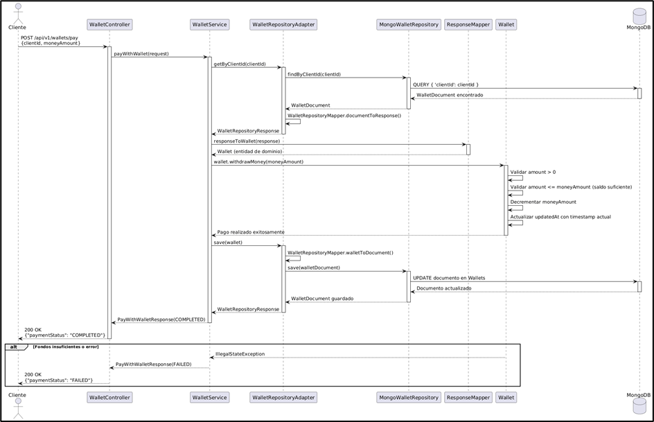


<details>
<summary><strong>🟢 Explicación del Flujo</strong></summary>

1. El flujo inicia con la solicitud de pago enviada al controlador.
2. El servicio de billetera valida el monto y el saldo disponible.
3. Si hay fondos suficientes, se realiza el débito y se retorna el estado del pago.
4. De lo contrario, se notifica el fallo sin modificar el saldo.

</details>

---


### 📊 Tipos de errores manejados

<div align="center">

| 🔢 **Código HTTP** | ⚠️ **Escenario** | 💬 **Mensaje de Error** |
|:------------------:|:----------------|:------------------------|
|  | moneyAmount es menor o igual a 0 | `"El monto a retirar debe ser positivo"` |
|  | clientId es nulo o vacío | `"ClientId es requerido"` |
|  | JSON malformado | `"Solicitud JSON Inválida. El formato del JSON es incorrecto. Verifique la sintaxis."` |
|  | Cliente no tiene billetera registrada | `"Wallet No Encontrada. Wallet of CLIENT_12345 does not exist"` |
|  | Error inesperado en el servidor | `"Ocurrió un error inesperado. Por favor, contacte al administrador."` |

</div>

---

### 4️⃣ Consultar Billetera por Cliente


**Endpoint principal:**  
`GET /api/v1/wallets/client/{clientId}`

---

### 📦 Estructura de la Solicitud (Request)

<div align="center">

| 🏷️ Campo    | 🗃️ Tipo | ⚠️ Restricciones                        | 📝 Descripción                                              |
|--------------|---------|:---------------------------------------:|-------------------------------------------------------------|
| ClientId     | String  | Obligatorio (Path Variable) | Identificador del cliente cuya billetera se desea consultar |

</div>

---

### 📦 Estructura de la Respuesta (Response)

<div align="center">

| 🏷️ Campo | 🗃️ Tipo | 📝 Descripción | 
|:---:|:---:|:---|
| walletId | String | Identificador único de la billetera | 
| clientId | String | Identificador del cliente propietario | 
| moneyAmount | Double | Saldo disponible en la billetera | 
| updatedAt | String | Timestamp de última actualización | 

</div>

---

### ✅ Happy Path (Ejemplo de Uso Exitoso)

1. El cliente envía el `clientId` como parámetro en la URL.
2. El sistema busca la billetera asociada al cliente.
3. Se retorna la información completa de la billetera.


**Request (Solicitud):**
```json
GET /api/v1/wallets/client/CLIENT_12345
```

**Response (Respuesta):**
```json
{
  "walletId": "WALLET_UUID",
  "clientId": "CLIENT_12345",
  "moneyAmount": 1000.0,
  "updatedAt": "2023-10-27T10:00:00Z"
}
```


---

### 🖼️ Diagrama de Secuencia

  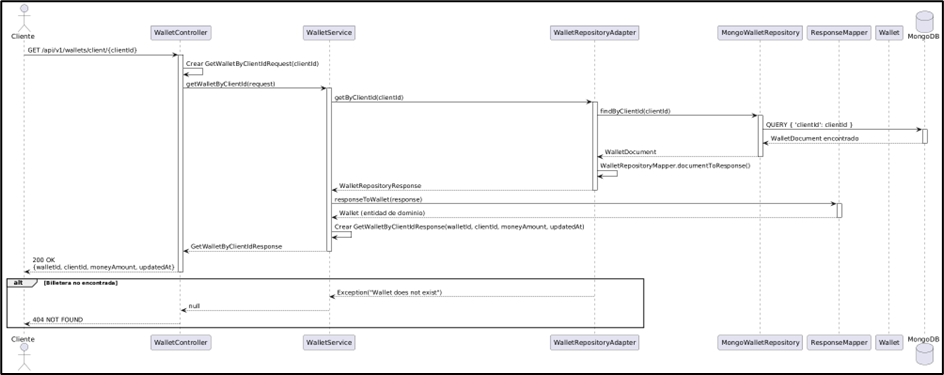


<details>
<summary><strong>🟢 Explicación del Flujo</strong></summary>

1. El controlador recibe la solicitud de consulta y delega al servicio de billetera.
2. El sistema consulta la base de datos buscando por `clientId`.
3. Si la billetera existe, se retorna la información asociada.

</details>

---


### 📊 Tipos de errores manejados

<div align="center">

| 🔢 **Código HTTP** | ⚠️ **Escenario** | 💬 **Mensaje de Error** |
|:------------------:|:----------------|:------------------------|
|  | Billetera encontrada exitosamente | Retorna el objeto JSON con los datos de la billetera |
|  | clientId es nulo o vacío | `"ClientId es requerido"` |
|  | Cliente no tiene billetera registrada | `"Wallet No Encontrada. Wallet of CLIENT_12345 does not exist"` |
|  | Error inesperado en el servidor | `"Ocurrió un error inesperado. Por favor, contacte al administrador."` |

</div>


---


## 7. 📊 Diagramas

Esta sección muestra los diagramas clave del microservicio de billetera, ilustrando su arquitectura, componentes principales y despliegue.

---

### 🏗️ Diagrama de Componentes — Vista General
<div align="center">

</div>


---

### 🔍 Diagrama de Componentes — Vista Específica

<div align="center">
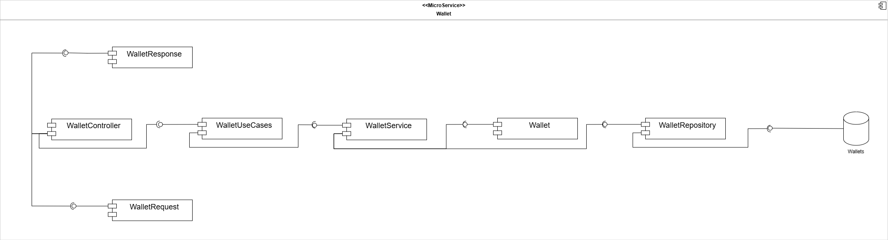
</div>

**Arquitectura Hexagonal:**  
El microservicio de Wallet separa controladores, casos de uso, lógica de negocio y adaptadores externos para mantener modularidad y escalabilidad.

**Flujo principal:**

- **WalletController**
  - Recibe solicitudes HTTP (`CreateWalletRequest`, `AddMoneyRequest`, etc.).
  - Delega la ejecución al puerto `WalletUseCases`, implementado por `WalletService`.

**Lógica de Negocio (Dominio):**

- **WalletService**
  - Orquesta la lógica de aplicación.
  - Se comunica con la entidad de dominio `Wallet`.
  - Utiliza `ResponseMapper` para convertir entidades en DTOs de salida.

- **Wallet (Entidad)**
  - Encapsula las reglas de negocio:
    - Validación de saldos suficientes (`withdrawMoney`).
    - Validación de montos positivos (`addMoney`).
    - Integridad de timestamps mediante `DateUtils`.

**Integración y Adaptadores:**

- **Persistencia:**
  - `WalletService` invoca el puerto `WalletRepositoryProvider`.
  - `WalletRepositoryAdapter` traduce entre el modelo de dominio y la persistencia (`WalletDocument`).
  - `WalletRepository` (Spring Data Mongo) persiste en MongoDB.

- **Manejo de Errores:**
  - `Wallet` lanza excepciones de dominio.
  - `WalletController` maneja excepciones específicas.
  - `GlobalExceptionHandler` estandariza respuestas HTTP.

### 🔌 Servicios Externos Integrados

El microservicio se integra con otros sistemas mediante REST/HTTP a través del API Gateway.

<div align="center">

| 🌍 **Microservicio** | ⚙️ **Operación** | 📋 **Propósito** |
|:---------------|:----------------|:-----------------------|
| **Payment** | Consultar saldo | Verificar fondos disponibles antes de procesar transacciones |
| **Payment** | Ejecutar débito | Descontar monto cuando se confirma un pago |
| **Payment** | Acreditar fondos | Recargar saldo desde fuentes externas |
| **QR/Receipt** | Validar pago | Verificar capacidad de pago antes de generar códigos QR |
| **QR/Receipt** | Obtener saldo | Incluir información actualizada en comprobantes |

</div>

**Dominio y Mapeo:**

- La entidad `Wallet` encapsula la lógica central.
- `WalletMapper` transforma los datos entre capas, asegurando respuestas completas y correctas.

> El diagrama ilustra cómo el dominio de la billetera se mantiene aislado de la infraestructura, permitiendo cambiar la base de datos o los adaptadores externos sin afectar las reglas de negocio.

---
### 📊 Diagrama de base de datos

<div align="center">
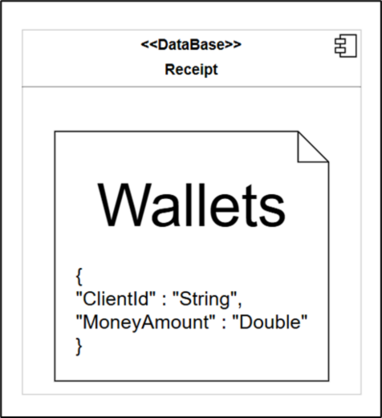
</div>

El microservicio Wallet utiliza **MongoDB** como sistema de gestión de base de datos NoSQL, aprovechando su flexibilidad para almacenar documentos JSON y su capacidad de escalamiento horizontal. La base de datos se denomina `Wallet-db` y contiene la colección `Wallets`, diseñada para persistir la información de las billeteras digitales de los clientes.

#### 📋 Colección: `Wallets`

La colección `Wallets` almacena documentos con la siguiente estructura:

<div align="center">

| 🏷️ Campo | 🗃️ Tipo | 📝 Descripción | ⚠️ Restricciones |
|:---|:---|:---|:---|
| **_id** | `ObjectId` | Identificador único generado automáticamente por MongoDB | Primary Key |
| **walletId** | `String` | Identificador de negocio de la billetera (formato: `WAL_XXXXXXXX`) | Único, Obligatorio |
| **clientId** | `String` | Identificador del cliente propietario de la billetera | Obligatorio, Indexado |
| **moneyAmount** | `Double` | Saldo disponible en la billetera | Obligatorio, >= 0 |
| **updatedAt** | `String` | Fecha y hora de la última actualización (ISO 8601) | Obligatorio |

</div>

**Características de diseño:**

- **Persistencia:** Se implementa a través del documento `WalletDocument`, mapeado con `@Document(collection = "Wallets")`.
- **Índices:**
  - `clientId`: Asegura unicidad por cliente y optimiza búsquedas (90% de las consultas).
  - `walletId`: Garantiza unicidad del identificador de negocio.
- **Repositorio:** `MongoWalletRepository` extiende `MongoRepository` para operaciones CRUD y queries automáticas (`findByClientId`).
- **Consistencia:** MongoDB garantiza atomicidad a nivel de documento. Spring Data gestiona transacciones con `@Transactional`.
- **Auditoría:** `updatedAt` se actualiza automáticamente mediante `DateUtils`.

---

### 📦 Diagrama de Clases del Dominio

<div align="center">
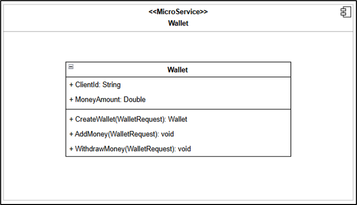
</div>

**Resumen del diseño de dominio:**

El diagrama de clases del microservicio Wallet muestra la estructura del modelo de dominio centrada en la clase **Wallet**, que representa el núcleo de la lógica de negocio.

- **Entidad de Dominio (DDD):** `Wallet` encapsula datos financieros (`clientId`, `moneyAmount`) y comportamientos (`createWallet`, `addMoney`, `withdrawMoney`).
- **Atributos Principales:**
  - `walletId`: Identificador único (`WAL_XXXXXXXX`).
  - `clientId`: Dueño de la billetera.
  - `moneyAmount`: Saldo actual.
  - `updatedAt`: Timestamp de auditoría (ISO 8601).
- **Factory Method:** `createWallet` inicializa la instancia, valida `clientId` y monto no negativo, y genera el ID.
- **Lógica Transaccional:**
  - `addMoney`: Valida montos positivos.
  - `withdrawMoney`: Valida fondos suficientes (Fail-fast con `IllegalStateException`).

> Este diseño centraliza las reglas de negocio, previniendo estados inválidos y asegurando la integridad de los datos antes de la persistencia.

---

### 📦 DTOs Principales

<div align="center">
<div style="background:#111; color:#fff; border-radius:12px; padding:24px 12px; box-shadow:0 2px 12px #0002;">

<table style="border:2px solid #4A90E2; border-radius:8px;">
  <caption style="font-size:1.15em; font-weight:bold; color:#4A90E2; padding:8px;">📨 <u>Request DTOs</u></caption>
  <thead style="background:#222; color:#fff;">
    <tr>
      <th style="padding:8px;">DTO</th>
      <th style="padding:8px;">Atributos Principales</th>
      <th style="padding:8px;">Descripción</th>
    </tr>
  </thead>
  <tbody>
    <tr>
      <td><b>CreateWalletRequest</b></td>
      <td>clientId, moneyAmount</td>
      <td>Solicitud para crear una nueva billetera con saldo inicial.</td>
    </tr>
    <tr>
      <td><b>AddMoneyRequest</b></td>
      <td>clientId, moneyAmount</td>
      <td>Solicitud para recargar saldo en una billetera existente.</td>
    </tr>
    <tr>
      <td><b>PayWithWalletRequest</b></td>
      <td>clientId, moneyAmount</td>
      <td>Solicitud para realizar un pago descontando del saldo disponible.</td>
    </tr>
    <tr>
      <td><b>GetWalletByClientIdRequest</b></td>
      <td>clientId</td>
      <td>Solicitud para consultar la información completa de la billetera.</td>
    </tr>
  </tbody>
</table>

<br>

<table style="border:2px solid #43A047; border-radius:8px;">
  <caption style="font-size:1.15em; font-weight:bold; color:#43A047; padding:8px;">📤 <u>Response DTOs</u></caption>
  <thead style="background:#222; color:#fff;">
    <tr>
      <th style="padding:8px;">DTO</th>
      <th style="padding:8px;">Atributos Principales</th>
      <th style="padding:8px;">Descripción</th>
    </tr>
  </thead>
  <tbody>
    <tr>
      <td><b>GetWalletByClientIdResponse</b></td>
      <td>walletId, clientId, moneyAmount, updatedAt</td>
      <td>Respuesta con información completa de la billetera.</td>
    </tr>
    <tr>
      <td><b>PayWithWalletResponse</b></td>
      <td>paymentStatus</td>
      <td>Indica el estado del pago (COMPLETED o FAILED).</td>
    </tr>
  </tbody>
</table>

<br>

<table style="border:2px solid #F0AD4E; border-radius:8px;">
  <caption style="font-size:1.15em; font-weight:bold; color:#F0AD4E; padding:8px;">⚙️ <u>DTOs Internos & Enums</u></caption>
  <thead style="background:#222; color:#fff;">
    <tr>
      <th style="padding:8px;">Objeto</th>
      <th style="padding:8px;">Detalle</th>
      <th style="padding:8px;">Descripción</th>
    </tr>
  </thead>
  <tbody>
    <tr>
      <td><b>WalletDocument</b></td>
      <td>walletId, clientId, moneyAmount, updatedAt</td>
      <td>Entidad de persistencia MongoDB (@Document).</td>
    </tr>
    <tr>
      <td><b>PaymentStatus</b></td>
      <td>PENDING, VALIDATING, PROCESSING, COMPLETED, FAILED, REFUNDED, CANCELLED, TIMEOUT</td>
      <td>Enum que representa el estado de una transacción.</td>
    </tr>
  </tbody>
</table>

</div>
</div>

---

### 🗄️ Diagrama de Despliegue

<div align="center">
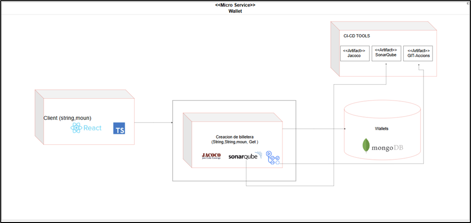
</div>

---

#### 🚀 Despliegue e Infraestructura

El microservicio de **Wallet** se ejecuta como un contenedor Docker en **Azure App Service**, respaldado por una arquitectura robusta de CI/CD y servicios en la nube.

- **Ejecución:** Contenedor Docker en Azure App Service (Imagen desde ACR).
- **Frontend:** React + TypeScript consume la API vía **API Gateway** (Enrutamiento, CORS, Auth).
- **Persistencia:** **MongoDB Atlas** (Colección `Wallets`) con alta disponibilidad y backups.
- **CI/CD (GitHub Actions):**
  - `ci.yml`: Pruebas (JUnit 5), Cobertura (JaCoCo), Calidad (SonarQube).
  - `cd_dev.yml`: Despliegue automático a Desarrollo (Rama `develop`).
  - `cd_prod.yml`: Despliegue automático a Producción (Rama `main`).
- **Construcción:** Dockerfile Multi-stage (Maven Build -> JRE Alpine Runtime).
- **Configuración:** Variables de entorno en Azure (`SPRING_PROFILES_ACTIVE`, `MONGODB_URI`).

<div align="center">

| 🌐 **Componente**         | 📝 **Descripción**                                 |
|--------------------------|---------------------------------------------------|
| Azure App Service        | Hosting del contenedor Docker del microservicio   |
| Azure Container Registry | Almacenamiento y versionado de imágenes Docker    |
| GitHub Actions           | Automatización de CI/CD y calidad de código       |
| API Gateway              | Punto de entrada único para el frontend           |
| MongoDB Atlas            | Base de datos NoSQL, alta disponibilidad y backups|

</div>

---

## 8. ⚠️ Manejo de Errores

El backend de **ECIExpress** implementa un **mecanismo centralizado de manejo de errores** que garantiza uniformidad, claridad y seguridad en todas las respuestas enviadas al cliente cuando ocurre un fallo.

Este sistema permite mantener una comunicación clara entre el backend y el frontend, asegurando que los mensajes de error sean legibles, útiles y coherentes, sin exponer información sensible del servidor.

---

### 🧠 Estrategia general de manejo de errores

El sistema utiliza una **clase global** que intercepta todas las excepciones lanzadas desde los controladores REST.  
A través de la anotación `@ControllerAdvice`, se centraliza el manejo de errores, evitando el uso repetitivo de bloques `try-catch` en cada endpoint.

Cada error se transforma en una respuesta **JSON estandarizada**, que mantiene un formato uniforme para todos los tipos de fallos.


---

### ⚙️ Global Exception Handler

El **Global Exception Handler** es una clase con la anotación `@ControllerAdvice` que captura y maneja todas las excepciones del sistema.  
Utiliza métodos con `@ExceptionHandler` para procesar errores específicos y devolver una respuesta personalizada acorde al tipo de excepción.

**✨ Características principales:**

- ✅ **Centraliza** la captura de excepciones desde todos los controladores
- ✅ **Retorna mensajes JSON consistentes** con el mismo formato estructurado
- ✅ **Asigna códigos HTTP** según la naturaleza del error (400, 404, 409, 500, etc.)
- ✅ **Define mensajes descriptivos** que ayudan tanto al desarrollador como al usuario
- ✅ **Mantiene la aplicación limpia**, eliminando bloques try-catch redundantes
- ✅ **Mejora la trazabilidad** y facilita la depuración en los entornos de prueba y producción


---

### 🧩 Validaciones en DTOs

Además del manejo global de errores, el sistema utiliza **validaciones automáticas** sobre los DTOs (Data Transfer Objects) para garantizar que los datos que llegan al servidor cumplan con las reglas de negocio antes de ejecutar cualquier lógica.

Estas validaciones se implementan mediante las anotaciones de **Javax Validation** y **Hibernate Validator**, como `@NotBlank`, `@NotNull`, `@Email`, `@Min`, `@Max`, entre otras.


Si alguno de los campos no cumple las validaciones, se lanza automáticamente una excepción del tipo `MethodArgumentNotValidException`.  
Esta es capturada por el **Global Exception Handler**, que devuelve una respuesta JSON estandarizada con el detalle del campo inválido.


> 💡 Gracias a este mecanismo, se asegura que las peticiones erróneas sean detectadas desde el inicio, reduciendo fallos en capas más profundas como servicios o repositorios.

---

### ✅ Beneficios del manejo centralizado

<div align="center">

| 🎯 **Beneficio** | 📋 **Descripción** |
|:-----------------|:-------------------|
| **🎯 Uniformidad** | Todas las respuestas de error tienen el mismo formato JSON estandarizado |
| **🔧 Mantenibilidad** | Agregar nuevas excepciones no requiere modificar cada controlador |
| **🔒 Seguridad** | Oculta los detalles internos del servidor y evita exponer trazas sensibles |
| **📍 Trazabilidad** | Cada error incluye información contextual (ruta, timestamp y descripción) |
| **🤝 Integración fluida** | Facilita la comunicación con frontend y herramientas como Postman/Swagger |

</div>

---

> Gracias a este enfoque, el backend de ECIExpress logra un manejo de errores **robusto**, **escalable** y **seguro**, garantizando una experiencia de usuario más confiable y profesional.

---


---

## 9. 🧪 Evidencia de las pruebas y cómo ejecutarlas

El backend de **ECIExpress** implementa una **estrategia integral de pruebas** que garantiza la calidad, funcionalidad y confiabilidad del código mediante pruebas unitarias y de integración.

---

### 🎯 Tipos de pruebas implementadas

<div align="center">

| 🧪 **Tipo de Prueba** | 📋 **Descripción** | 🛠️ **Herramientas** |
|:---------------------|:-------------------|:--------------------|
| **Pruebas Unitarias** | Validan el funcionamiento aislado de componentes (servicios, estrategias, validadores) |   |
| **Cobertura de Código** | Mide el porcentaje de código cubierto por las pruebas |  |
| **Pruebas de Integración** | Verifican la interacción entre capas y servicios externos |  |

</div>

---

### 🚀 Cómo ejecutar las pruebas

#### **1️⃣ Ejecutar todas las pruebas**

Desde la raíz del proyecto, ejecuta:

```bash
mvn clean test
```

Este comando:
- Limpia compilaciones anteriores (`clean`)
- Ejecuta todas las pruebas unitarias y de integración (`test`)
- Muestra el resultado en la consola

#### **2️⃣ Generar reporte de cobertura con JaCoCo**

```bash
mvn clean test jacoco:report
```

El reporte HTML se generará en:
```
target/site/jacoco/index.html
```

Abre este archivo en tu navegador para ver:
- Cobertura por paquete
- Cobertura por clase
- Líneas cubiertas vs. no cubiertas

#### **3️⃣ Ejecutar pruebas desde IntelliJ IDEA**

1. Click derecho sobre la carpeta `src/test/java`
2. Selecciona **"Run 'Tests in...'**
3. Ver resultados en el panel inferior

#### **4️⃣ Ejecutar una prueba específica**

```bash
mvn test -Dtest=WalletControllerTest
```

---

### 🧪 Ejemplo de prueba de integración

A continuación se muestra un ejemplo real de una prueba de integración para el controlador de billetera (`WalletController`), donde se valida la creación exitosa de una billetera simulando una petición HTTP.

```java
    @Test
    @DisplayName("Should create wallet and return 201")
    void shouldCreateWalletAndReturn201() throws Exception {
     
        // Arrange
        CreateWalletRequest request = new CreateWalletRequest("CLIENT123", 1000.0);
        when(walletUseCases.createWallet(any())).thenReturn(true);

        // Act & Assert
        mockMvc.perform(post("/api/v1/wallets")
                .contentType(MediaType.APPLICATION_JSON)
                .content(objectMapper.writeValueAsString(request)))
                .andExpect(status().isCreated());
    }
```

---

### 🖼️ Evidencias de ejecución

1. **Consola mostrando pruebas ejecutándose exitosamente**

    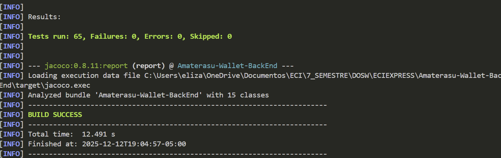

2. **Reporte JaCoCo con cobertura de código**

    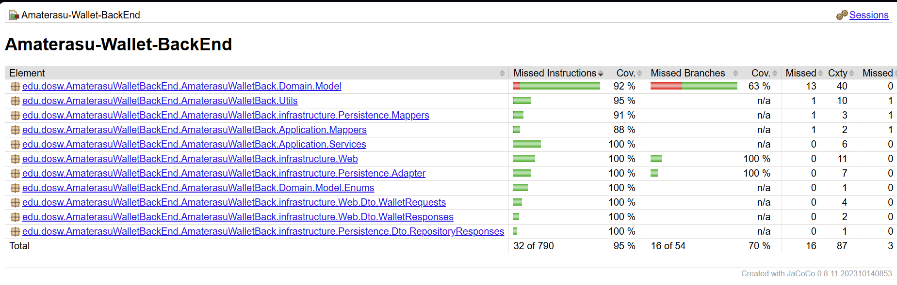

---

### ✅ Criterios de aceptación de pruebas

Para considerar el sistema correctamente probado, se debe cumplir:

- ✅ **Cobertura mínima del 80%** en servicios y lógica de negocio
- ✅ **Todas las pruebas en estado PASSED** (sin fallos)
- ✅ **Cero errores de compilación** en el código de pruebas
- ✅ **Pruebas de casos felices y casos de error** implementadas

---

### 🔄 Integración con CI/CD

Las pruebas se ejecutan automáticamente en cada **push** o **pull request** mediante GitHub Actions:

```yaml
  - name: Build + Test + Coverage
    run: mvn -B clean verify
```

Esto garantiza que ningún cambio roto llegue a producción.

---

## 10. 🗂️ Código de la implementación organizado en las respectivas carpetas

El microservicio de **Pagos de Amaterasu** sigue una **arquitectura hexagonal (puertos y adaptadores)** que separa las responsabilidades en capas bien definidas, promoviendo la escalabilidad, testabilidad y mantenibilidad del código.

---

### 📂 Estructura general del proyecto (Scaffolding)

```
Amaterasu-Payment-BackEnd/
│
├── 📁 src/
│   ├── 📁 main/
│   │   ├── 📁 java/ECIEXPRESS/AmaterasuPagos/Payment/BackEnd/
│   │   │   ├── 📁 Application/                               # 🔵 CAPA DE APLICACIÓN
│   │   │   │   ├── 📁 Dto/
│   │   │   │   ├── 📁 Mappers/
│   │   │   │   ├── 📁 Ports/
│   │   │   │   └── 📁 Services/
│   │   │   │
│   │   │   ├── 📁 Config/                                    # ⚙️ Configuraciones
│   │   │   │
│   │   │   ├── 📁 Domain/                                    # 🟢 CAPA DE DOMINIO
│   │   │   │   ├── 📁 Model/
│   │   │   │   └── 📁 Ports/
│   │   │   │
│   │   │   ├── 📁 Exception/                                 # ⚠️ Manejo de errores
│   │   │   │
│   │   │   ├── 📁 Infrastructure/                            # 🟠 CAPA DE INFRAESTRUCTURA
│   │   │   │   ├── 📁 Clients/
│   │   │   │   └── 📁 Web/
│   │   │   │
│   │   │   └── 📁 Utils/                                     # 🛠️ Utilidades
│   │   │
│   │   └── 📁 resources/                                     # 📄 Archivos de configuración
│   │
│   └── 📁 test/                                              # 🧪 PRUEBAS
│
├── 📁 doc/                                                   # 📚 Documentación
│
├── 📄 Dockerfile
├── 📄 docker-compose.yml
├── 📄 pom.xml
└── 📄 README.md
```

---

> ℹ️ Todo el código fuente está documentado y comentado para facilitar su comprensión, mantenimiento y extensión por parte de cualquier desarrollador.

### 🏛️ Arquitectura Hexagonal Implementada

<div align="center">

| 🎨 **Capa** | 📋 **Responsabilidad** | 🔗 **Dependencias** |
|:-----------|:----------------------|:-------------------|
| **🟢 Domain** | Lógica de negocio pura, entidades (`Payment`, `BankPayment`) y puertos (interfaces) | ❌ Ninguna (independiente) |
| **🔵 Application** | Casos de uso, estrategias de pago (`CashPaymentStrategy`, `BankPaymentStrategy`) y validaciones | ✅ Solo `Domain` |
| **🟠 Infrastructure** | Controladores REST, adaptadores de servicios externos (PayU, Billetera, Promociones, Recibos) | ✅ `Domain` + `Application` |

</div>

**Flujo de dependencias:** `Infrastructure → Application → Domain`

---

### 🎯 Principios de diseño aplicados

<div align="center">

| ✅ **Principio** | 📋 **Implementación** |
|:----------------|:---------------------|
| **Separación de responsabilidades** | Cada capa tiene un propósito único y bien definido |
| **Inversión de dependencias** | Las capas externas dependen de interfaces definidas en el dominio |
| **Independencia del framework** | La lógica de negocio no depende de Spring o MongoDB |
| **Patrón Strategy** | Estrategias intercambiables para diferentes métodos de pago |
| **Testabilidad** | Fácil crear pruebas unitarias mockeando puertos y adaptadores |
| **Mantenibilidad** | Cambios en una capa no afectan a las demás |

</div>  

---

## 11. 🚀 Ejecución del Proyecto

### 📋 Prerrequisitos
- **Java 17**
- **Maven 3.8+**
- **Docker** (Opcional)

### 🛠️ Opción 1: Ejecución Local (Maven)

```bash
# 1. Clonar repositorio
git clone https://github.com/ECIXPRESS/Amaterasu-Payment-BackEnd.git

# 2. Ejecutar aplicación
mvn spring-boot:run
```
📍 **URL Local:** `http://localhost:8085`  
📚 **Documentación API:** `http://localhost:8085/swagger-ui.html`

### 🐳 Opción 2: Ejecución con Docker

```bash
# Levantar el contenedor
docker-compose up --build -d
```

### ⚙️ Configuración
El servicio se conecta por defecto a los otros microservicios en `localhost`. Para cambiar esto, ajusta `application.yml` o usa variables de entorno.

## 12. ☁️ CI/CD y Despliegue en Azure

El proyecto implementa un **pipeline automatizado** con **GitHub Actions** para garantizar la calidad del código y el despliegue continuo en **Azure Cloud**.

---

### 🔗 Enlaces de Despliegue

<div align="center">

| 🌍 Ambiente | 🔗 URL | 📝 Estado |
|:-----------|:-------|:---------|
| **🟢 Producción** | [amaterasu-wallet-prod-deabf2bhaxcnbte4.eastus2-01.azurewebsites.net/swagger-ui/index.html  ](amaterasu-wallet-prod-deabf2bhaxcnbte4.eastus2-01.azurewebsites.net/swagger-ui/index.html   ) |  |
| **🟠 Desarrollo** | [amaterasu-wallet-dev-h4cne5g2erh3fzg9.eastus2-01.azurewebsites.net/swagger-ui/index.html  ](amaterasu-wallet-dev-h4cne5g2erh3fzg9.eastus2-01.azurewebsites.net/swagger-ui/index.html  ) |  |

</div>

---

### 🔄 Pipeline de Automatización

El flujo de trabajo se divide en dos etapas principales:

1. **Integración Continua (CI)**: Se ejecuta en cada *Pull Request*.
   - Compilación del proyecto con Maven.
   - Ejecución de pruebas unitarias y de integración.
   - Análisis de calidad de código con **SonarQube**.
   - Generación de reportes de cobertura con **JaCoCo**.

2. **Despliegue Continuo (CD)**: Se ejecuta al hacer merge a ramas principales.
   - Construcción de la imagen Docker.
   - Publicación de la imagen en **Azure Container Registry (ACR)**.
   - Despliegue automático en **Azure App Service**.
     - `develop` ➔ Ambiente de Desarrollo.
     - `main` ➔ Ambiente de Producción.

---

### ☁️ Infraestructura

<div align="center">

| Componente | Servicio Azure | Propósito |
|:-----------|:---------------|:----------|
| **Compute** |  | Ejecución del contenedor Docker del microservicio. |
| **Storage** |  | Almacenamiento privado de imágenes Docker. |
| **Database** |  | Persistencia de datos transaccionales. |
| **Monitoring** |  | Logs, métricas y trazabilidad en tiempo real. |

</div>

---

### 📊 Evidencias de Despliegue

**Azure Web App - Aplicación en ejecución**

<div align="center">
  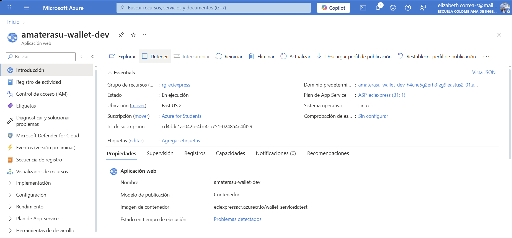
  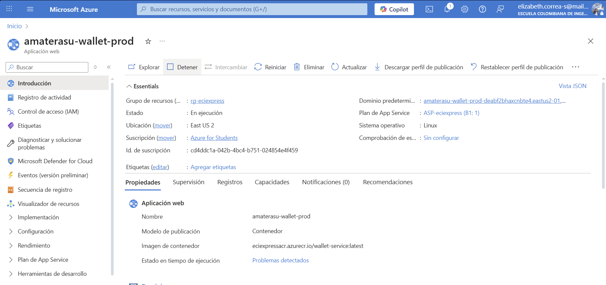
</div>

---

## 13. 🤝 Contribuciones y Metodología

El equipo **Amaterasu** aplicó la metodología **Scrum** con sprints semanales para garantizar una entrega incremental de valor y mejora continua.

### 👥 Equipo Scrum

| Rol | Responsabilidad |
|:---|:---|
| **Product Owner** | Priorización del Backlog y maximización de valor. |
| **Scrum Master** | Facilitador del proceso y eliminación de impedimentos. |
| **Developers** | Diseño, implementación y pruebas de funcionalidades. |

### 🔄 Eventos y Artefactos

- **Sprints Semanales**: Ciclos cortos de desarrollo.
- **Daily Scrum**: Sincronización diaria (15 min).
- **Sprint Review & Retrospective**: Demostración de incrementos y mejora de procesos.
- **Backlogs**: Gestión de tareas en Jira/GitHub Projects.

### 🎯 Valores del Equipo
Compromiso, Coraje, Enfoque, Apertura y Respeto fueron los pilares para afrontar desafíos técnicos como la integración con pasarelas de pago.

---

<div align="center">

### 🏆 Equipo **Amaterasu**


> 💡 **ECIEXPRESS - Microservicio de Pagos** es un proyecto académico, pero su arquitectura y calidad están pensadas para ser escalables y adaptables a escenarios reales en instituciones educativas.

**🎓 Escuela Colombiana de Ingeniería Julio Garavito**

</div>

---


